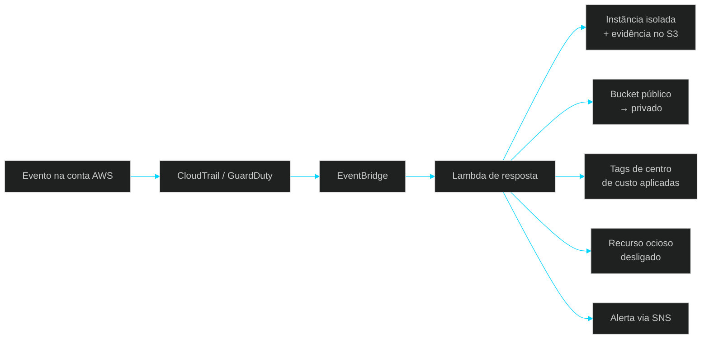

**Infraestrutura em nuvem segura, auditável e automatizada.**
AWS · Terraform · IAM · CI/CD · FinOps

 

 

[**Portfólio**](https://johnataa.vercel.app) &nbsp;·&nbsp; [**GitHub**](https://github.com/kctxdev) &nbsp;·&nbsp; [**E-mail**](mailto:johnataichigo56@gmail.com) &nbsp;·&nbsp; [**WhatsApp**](https://wa.me/5511959445413)

 

## Sobre

Analista Júnior em **Cloud & DevSecOps**, estudante de Segurança da Informação, com foco em AWS.

Projeto e automatizo ambientes em nuvem partindo de três princípios: **segurança desde a concepção** (*Security by Design*), **menor privilégio** (*Least Privilege*) e **tudo como código**, versionado, revisável e reproduzível.

 

## O que entrego

<table>
<tr>
<td width="50%" valign="top">

#### ☁️ Cloud & Infraestrutura como Código
VPC, EC2, S3, IAM e Route53 provisionados com Terraform: padronizado, versionado e repetível.

</td>
<td width="50%" valign="top">

#### 🛡️ Segurança & Governança
Auditoria com CloudTrail, detecção de ameaças com GuardDuty, criptografia com KMS e MFA.

</td>
</tr>
<tr>
<td width="50%" valign="top">

#### 🔁 CI/CD Seguro
Pipelines com GitHub Actions, gestão de segredos e deploys sem credenciais expostas.

</td>
<td width="50%" valign="top">

#### 💰 FinOps
Monitoramento de custos, alertas proativos e desligamento automático de recursos ociosos.

</td>
</tr>
</table>

 

## Projetos em destaque

<table>
<tr>
<td width="50%" valign="top">

### 🛰️ CloudGuard
**Detecção e resposta automática a incidentes na AWS.**

Reduz o tempo entre a ameaça e a contenção, sem depender de ação manual.

- Isola instâncias comprometidas (GuardDuty, severidade ≥ 7)
- Preserva evidências no S3 e alerta o time via SNS
- Corrige buckets S3 públicos automaticamente
- Garante tags de centro de custo
- Desliga recursos ociosos (FinOps)

`Terraform` `GuardDuty` `Lambda` `EventBridge` `CloudTrail` `SNS`

[Ver repositório →](https://github.com/kctxdev/cloudguard-aws-security)

</td>
<td width="50%" valign="top">

### 🔐 Pipeline CI/CD DevSecOps
**Deploy de infraestrutura sem chaves no código.**

Elimina o deploy manual e a exposição de credenciais.

- Segredos gerenciados no AWS Secrets Manager
- IaC seguindo o menor privilégio
- Validação e deploy automáticos a cada push

`GitHub Actions` `Terraform` `Secrets Manager` `IAM`

 

[Ver repositório →](https://github.com/kctxdev/aws-cicd-devsecops)

</td>
</tr>
<tr>
<td width="50%" valign="top">

### 🌐 AWS Secure VPC
**Base de rede e armazenamento segura desde o primeiro deploy.**

Acaba com configuração manual inconsistente e risco de vazamento.

- Sub-redes e security groups padronizados
- S3 criptografado, versionado e sem acesso público

`Terraform` `VPC` `S3` `HCL`

[Ver repositório →](https://github.com/kctxdev/aws-secure-vpc-terraform)

</td>
<td width="50%" valign="top">

### 📊 AWS Monitoramento
**Auditoria contínua e controle de custos.**

Evita cobranças surpresa e deixa a conta pronta para auditorias.

- Registro de todas as chamadas de API
- Alerta por e-mail quando o gasto passa de US$ 10

`CloudTrail` `CloudWatch` `SNS` `S3` `Terraform`

[Ver repositório →](https://github.com/kctxdev/aws-monitoramento-terraform)

</td>
</tr>
<tr>
<td width="50%" valign="top">

### 🎙️ Finance AI Voice API
**Orçamento financeiro por comandos de voz.**

Une back-end Java e IA generativa em uma API conversacional.

- Transcrição e interpretação dos comandos por IA
- Tool Calling para executar ações no orçamento
- Resposta por síntese de voz

`Java` `Spring Boot` `Spring AI`

<!-- Descomente e coloque o link real do repositório:
[Ver repositório →](https://github.com/kctxdev/NOME-DO-REPO)
-->

</td>
<td width="50%" valign="top">

### 🤖 Caçador de Vagas Pro
**Bot de Telegram que agrega vagas de vários sites.**

Economiza horas de busca manual e entrega só o que é relevante.

- Filtro de precisão contra falsos positivos
- Cache SQLite de 30 min com resposta instantânea
- Geolocalização automática via IP

`Python` `SQLite` `BeautifulSoup4` `Telegram API`

[Ver repositório →](https://github.com/kctxdev/cacador-de-vagas-bot)

</td>
</tr>
</table>

 

## Arquitetura do CloudGuard

 

## Stack

| | |
|:--|:--|
| **☁️ Cloud** |       |
| **🛡️ Segurança** |      |
| **⚙️ DevOps** |      |
| **💻 Desenvolvimento** |     |
| **🖥️ Sistemas & Redes** |     |
| **🧰 Ferramentas** |      |

 

## Em desenvolvimento

| Frente | Status |
|:--|:--|
| AWS Certified Cloud Practitioner (CLF-C02) | 🟡 Em preparação |
| Terraform avançado (modules) | 🟡 Em andamento |
| Kubernetes & Container Security | 🟡 Em andamento |
| Certificação em Segurança da Informação | 🟡 Em andamento |
| Automações de governança e FinOps na AWS | 🔵 Em construção |
| Java + Spring Boot com IA | 🔵 Em exploração |

 

## GitHub

 

<picture>
  <source media="(prefers-color-scheme: dark)" srcset="https://raw.githubusercontent.com/kctxdev/kctxdev/output/github-contribution-grid-snake-dark.svg" />
  <source media="(prefers-color-scheme: light)" srcset="https://raw.githubusercontent.com/kctxdev/kctxdev/output/github-contribution-grid-snake.svg" />
  
</picture>

 

## Contato

Aberto a oportunidades **PJ / CLT** em Cloud & Security.

<!-- Descomente e troque pelo seu link real do LinkedIn:

-->

