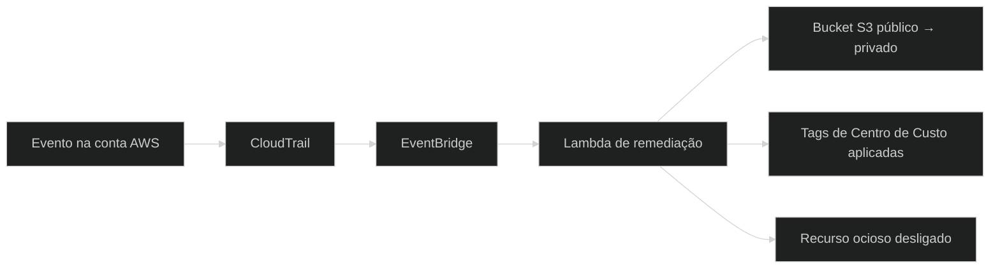

<div align="center">


<br/>

```
[SYSTEM BOOT] ................. OK
[LOADING PROFILE] ............. OK
[SECURITY MODULE] ............. ACTIVE
[CLOUD ENGINE: AWS] ........... ONLINE
[IAC ENGINE: TERRAFORM] ....... READY
[STATUS] ...................... #OPENTOWORK
```


<br/><br/>


<br/><br/>


</div>


## 👤 SOBRE MIM

```yaml
> whoami

nome:          Johnata Williamy Sousa da Silva
cargo:         Analista Júnior em Cloud & DevSecOps
localizacao:   Guarulhos - SP, Brasil
foco:          Segurança da Informação & Cloud Computing (AWS)
formacao:      Cursando Técnico/Superior em Segurança da Informação
missao:        Construir infraestruturas em nuvem seguras, auditáveis
               e automatizadas, aplicando Security by Design e o
               princípio do Menor Privilégio (Least Privilege).
idiomas:       [Português - Nativo, Inglês - Intermediário]
```


## 🔭 AGORA

```bash
johnata@devsecops:~$ cat now.txt

🎓 estudando   → AWS CLF-C02, Terraform avançado (modules), Kubernetes & Container Security
🛠️ construindo → automações de governança e FinOps na AWS, pipelines CI/CD seguros
☕ explorando  → Java + Spring Boot com IA
📫 buscando    → oportunidades PJ / CLT em Cloud & Security
```


## 🧭 ÁREAS DE ATUAÇÃO

| Área | O que eu entrego |
|---|---|
| ☁️ **Cloud & IaC** | VPC, EC2, S3, IAM e Route53 provisionados com Terraform: versionado, auditável e repetível |
| 🛡️ **Segurança & Governança** | CloudTrail, GuardDuty, KMS e MFA para auditoria, detecção de ameaças e criptografia |
| 🔁 **CI/CD seguro** | Pipelines com GitHub Actions, gestão de segredos e menor privilégio |
| 💰 **FinOps** | Monitoramento de custos e desligamento automático de recursos ociosos |


## 🧰 TECH STACK

<div align="center">

**☁️ Cloud & Infraestrutura**


**🛡️ Segurança & Governança**


**⚙️ DevOps & Automação**


**💻 Linguagens & Frameworks**


**🖥️ Sistemas & Redes**


</div>


## 🛠️ FERRAMENTAS

<div align="center">

</div>


## 🚀 PROJETOS EM DESTAQUE

<table>
<tr>
<td width="50%" valign="top">

### 🛰️ Cloud Guard — Governança & FinOps
**Plataforma orientada a eventos para remediação em tempo real de riscos de segurança e desperdício financeiro na AWS.**

`AWS Lambda (Python)` `EventBridge` `CloudTrail` `Terraform`

- 🔒 Auto-remediação de buckets S3 públicos
- 🏷️ Compliance automático de tags (Centro de Custo)
- 💰 Desligamento automático de recursos ociosos (FinOps)

<a href="https://github.com/kctxdev/cloudguard-aws-security">

</a>

</td>
<td width="50%" valign="top">

### 🔐 Pipeline CI/CD DevSecOps
**Esteira de deploy automatizada com foco total em segurança e gestão de segredos.**

`GitHub Actions` `Terraform` `AWS Secrets Manager` `IAM`

- 🚫 Zero exposição de chaves no código-fonte
- 🧩 IaC segura seguindo o menor privilégio
- 🔁 Deploys automatizados de infraestrutura

<a href="https://github.com/kctxdev/aws-cicd-devsecops">

</a>

</td>
</tr>

<tr>
<td width="50%" valign="top">

### 🌐 AWS Secure VPC (Terraform)
**Infraestrutura como Código para provisionamento de VPC e bucket S3 seguros na AWS.**

`Terraform` `AWS VPC` `S3` `HCL`

- 🧱 Sub-redes e security groups padronizados
- 🛡️ Security by Design desde a concepção

<a href="https://github.com/kctxdev/aws-secure-vpc-terraform">

</a>

</td>
<td width="50%" valign="top">

### 📊 AWS Monitoramento (Terraform)
**Sistema automatizado de auditoria e monitoramento de custos na AWS.**

`CloudTrail` `S3` `CloudWatch` `SNS` `Terraform`

- 📈 Monitoramento contínuo de custos e eventos
- 🔔 Alertas via SNS integrados
- ⚙️ Foco em DevSecOps e FinOps

<a href="https://github.com/kctxdev/aws-monitoramento-terraform">

</a>

</td>
</tr>

<tr>
<td width="50%" valign="top">

### 🎙️ Finance AI Voice API
**API de orçamento financeiro controlada por comandos de voz, com transcrição, Tool Calling e resposta em áudio.**

`Java` `Spring Boot` `Spring AI`

- 🗣️ Comandos de voz transcritos e interpretados por IA
- 🧰 Tool Calling para executar ações no orçamento
- 🔊 Resposta por síntese de voz

<!-- Descomente e coloque o link real do repositório:
<a href="https://github.com/kctxdev/NOME-DO-REPO">

</a>
-->

</td>
<td width="50%" valign="top">

### 🤖 Caçador de Vagas Pro — Telegram Bot
**Bot que agrega vagas de emprego de vários sites do Brasil ao mesmo tempo, entregando as melhores oportunidades direto no chat.**

`Python` `pyTelegramBotAPI` `BeautifulSoup4` `SQLite3`

- 🎯 Filtro Sniper contra vagas falso-positivas
- ⚡ Cache SQLite (30 min) para respostas instantâneas
- 📍 Geolocalização automática via IP

<a href="https://github.com/kctxdev/cacador-de-vagas-bot">

</a>

</td>
</tr>
</table>


## 🎯 OBJETIVOS ATUAIS

```bash
johnata@devsecops:~$ cat objetivos_2026.txt

[■■■■■■■■■■□□] 85%  AWS Certified Cloud Practitioner (CLF-C02)
[■■■■■■■□□□□□] 60%  Certificação em Segurança da Informação
[■■■■■■■■□□□□] 70%  Terraform avançado (Modules)
[■■■■■□□□□□□□] 45%  Kubernetes & Container Security
[■■■■■■■■■■■□] 90%  Boas práticas DevSecOps em produção

johnata@devsecops:~$ echo $STATUS
> Disponível para novas oportunidades PJ / CLT em Cloud & Security
```


## 📜 CERTIFICAÇÕES

<div align="center">

</div>


## 🏗️ COMO O CLOUD GUARD FUNCIONA

Fluxo simplificado da remediação automática:




## 📈 GITHUB ANALYTICS

<div align="center">


<br/>


</div>


## 🐍 CONTRIBUTION SNAKE

<div align="center">
<picture>
  <source media="(prefers-color-scheme: dark)" srcset="https://raw.githubusercontent.com/kctxdev/kctxdev/output/github-contribution-grid-snake-dark.svg" />
  <source media="(prefers-color-scheme: light)" srcset="https://raw.githubusercontent.com/kctxdev/kctxdev/output/github-contribution-grid-snake.svg" />
  
</picture>
</div>


## 📡 CONECTE-SE COMIGO

<div align="center">

<!-- Descomente e troque pelo seu link real do LinkedIn:
<a href="https://www.linkedin.com/in/SEU-USUARIO" target="_blank">

</a>
-->
<!-- Descomente e coloque o link do seu portfólio:
<a href="https://SEU-PORTFOLIO.com" target="_blank">

</a>
-->
<a href="mailto:johnataichigo56@gmail.com">

</a>
<a href="https://github.com/kctxdev" target="_blank">

</a>
<a href="https://wa.me/5511959445413" target="_blank">

</a>
<a href="https://johnataa.vercel.app" target="_blank">

</a>
<br/><br/>


<sub>Feito com 🛡️ + ☁️ por **Johnata Williamy** — Cloud & DevSecOps</sub>

</div>
