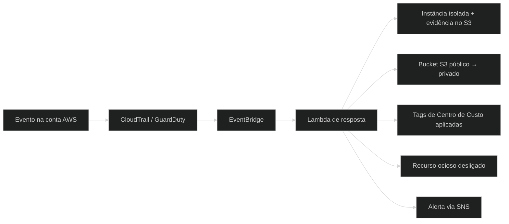

**AWS · Terraform · IAM · Security by Design**

---

## Sobre mim

Sou **Analista Júnior em Cloud & DevSecOps**, estudante de Segurança da Informação, com foco em Cloud Computing na AWS.

Minha missão é construir infraestruturas em nuvem **seguras, auditáveis e automatizadas**, aplicando *Security by Design* e o princípio do **Menor Privilégio (Least Privilege)**.

| | |
|---|---|
| **Localização** | Guarulhos, SP, Brasil |
| **Formação** | Cursando Técnico/Superior em Segurança da Informação |
| **Idiomas** | Português (nativo) · Inglês (intermediário) |
| **Disponibilidade** | Oportunidades PJ / CLT em Cloud & Security |

---

## Foco atual

- **Estudando:** AWS CLF-C02, Terraform avançado (modules), Kubernetes e Container Security
- **Construindo:** automações de governança e FinOps na AWS, pipelines CI/CD seguros
- **Explorando:** Java + Spring Boot com IA
- **Buscando:** oportunidades PJ / CLT em Cloud & Security

---

## Áreas de atuação

| Área | O que eu entrego |
|---|---|
| ☁️ **Cloud & IaC** | VPC, EC2, S3, IAM e Route53 provisionados com Terraform: versionado, auditável e repetível |
| 🛡️ **Segurança & Governança** | CloudTrail, GuardDuty, KMS e MFA para auditoria, detecção de ameaças e criptografia |
| 🔁 **CI/CD seguro** | Pipelines com GitHub Actions, gestão de segredos e menor privilégio |
| 💰 **FinOps** | Monitoramento de custos e desligamento automático de recursos ociosos |

---

## Tech stack

**Cloud & Infraestrutura**

**Segurança & Governança**

**DevOps & Automação**

**Linguagens & Frameworks**

**Sistemas & Redes**

**Ferramentas**

---

## Projetos em destaque

<table>
<tr>
<td width="50%" valign="top">

### 🛰️ CloudGuard: Detecção e Resposta a Incidentes
Plataforma orientada a eventos para detecção, contenção e remediação de riscos de segurança e desperdício financeiro na AWS.

`Terraform` `GuardDuty` `Lambda (Python)` `EventBridge` `CloudTrail` `SNS`

- Isolamento automático de instâncias comprometidas (GuardDuty, severidade ≥ 7)
- Evidências preservadas no S3 e alerta ao time via SNS
- Auto-remediação de buckets S3 públicos
- Compliance automático de tags (Centro de Custo)
- Desligamento automático de recursos ociosos (FinOps)

<a href="https://github.com/kctxdev/cloudguard-aws-security">Ver repositório →</a>

</td>
<td width="50%" valign="top">

### 🔐 Pipeline CI/CD DevSecOps
Esteira de deploy automatizada com foco em segurança e gestão de segredos.

`GitHub Actions` `Terraform` `AWS Secrets Manager` `IAM`

- Zero exposição de chaves no código-fonte
- IaC segura seguindo o menor privilégio
- Deploys automatizados de infraestrutura

<a href="https://github.com/kctxdev/aws-cicd-devsecops">Ver repositório →</a>

</td>
</tr>

<tr>
<td width="50%" valign="top">

### 🌐 AWS Secure VPC (Terraform)
Infraestrutura como Código para provisionamento de VPC e bucket S3 seguros na AWS.

`Terraform` `AWS VPC` `S3` `HCL`

- Sub-redes e security groups padronizados
- Security by Design desde a concepção

<a href="https://github.com/kctxdev/aws-secure-vpc-terraform">Ver repositório →</a>

</td>
<td width="50%" valign="top">

### 📊 AWS Monitoramento (Terraform)
Sistema automatizado de auditoria e monitoramento de custos na AWS.

`CloudTrail` `S3` `CloudWatch` `SNS` `Terraform`

- Monitoramento contínuo de custos e eventos
- Alertas via SNS integrados
- Foco em DevSecOps e FinOps

<a href="https://github.com/kctxdev/aws-monitoramento-terraform">Ver repositório →</a>

</td>
</tr>

<tr>
<td width="50%" valign="top">

### 🎙️ Finance AI Voice API
API de orçamento financeiro controlada por comandos de voz, com transcrição, Tool Calling e resposta em áudio.

`Java` `Spring Boot` `Spring AI`

- Comandos de voz transcritos e interpretados por IA
- Tool Calling para executar ações no orçamento
- Resposta por síntese de voz

<!-- Descomente e coloque o link real do repositório:
<a href="https://github.com/kctxdev/NOME-DO-REPO">Ver repositório →</a>
-->

</td>
<td width="50%" valign="top">

### 🤖 Caçador de Vagas Pro (Telegram Bot)
Bot que agrega vagas de vários sites do Brasil ao mesmo tempo, entregando as melhores oportunidades direto no chat.

`Python` `pyTelegramBotAPI` `BeautifulSoup4` `SQLite3`

- Filtro de precisão contra vagas falso-positivas
- Cache SQLite (30 min) para respostas instantâneas
- Geolocalização automática via IP

<a href="https://github.com/kctxdev/cacador-de-vagas-bot">Ver repositório →</a>

</td>
</tr>
</table>

---

## Como o CloudGuard funciona

---

## Objetivos 2026

| Objetivo | Progresso |
|---|---|
| AWS Certified Cloud Practitioner (CLF-C02) | 85% |
| Certificação em Segurança da Informação | 60% |
| Terraform avançado (Modules) | 70% |
| Kubernetes & Container Security | 45% |
| Boas práticas DevSecOps em produção | 90% |

## Certificações

---

## GitHub analytics

 

  

<picture>
  <source media="(prefers-color-scheme: dark)" srcset="https://raw.githubusercontent.com/kctxdev/kctxdev/output/github-contribution-grid-snake-dark.svg" />
  <source media="(prefers-color-scheme: light)" srcset="https://raw.githubusercontent.com/kctxdev/kctxdev/output/github-contribution-grid-snake.svg" />
  
</picture>

---

## Contato

<!-- Descomente e troque pelo seu link real do LinkedIn:

-->

  

Feito com 🛡️ + ☁️ por <b>Johnata Williamy</b> · Cloud & DevSecOps

